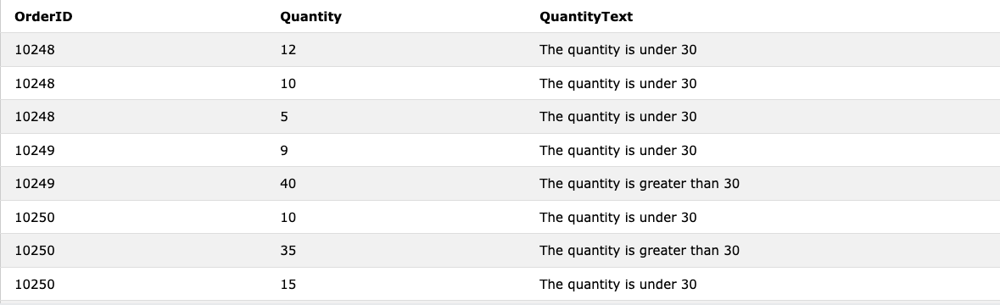

- [SQL ゼロから始めるデータベース操作](#sql-ゼロから始めるデータベース操作)
<<<<<<< HEAD
- [接続](#接続)
=======
>>>>>>> 382b6ee04aca07b3a45236b2afb524f15f856e7d
- [データベースとSQL](#データベースとsql)
  - [テーブルの変更](#テーブルの変更)
    - [テーブルにカラムを追加する](#テーブルにカラムを追加する)
    - [テーブルのカラムを削除する](#テーブルのカラムを削除する)
    - [テーブル名を変更する](#テーブル名を変更する)
    - [テーブル作成](#テーブル作成)
- [検索の基本 だいぶ難しくなってきたぞおおおおおおおおおおおお](#検索の基本-だいぶ難しくなってきたぞおおおおおおおおおおおお)
  - [SELECT文](#select文)
    - [重複行を省く](#重複行を省く)
  - [論理演算子](#論理演算子)
    - [NOT](#not)
    - [WHEREの強弱](#whereの強弱)
    - [NULLに比較演算子は使えない](#nullに比較演算子は使えない)
  - [集約関数で重複値を除外する](#集約関数で重複値を除外する)
  - [グループ化](#グループ化)
    - [WHEREを使う場合](#whereを使う場合)
  - [複数のGROUP BY](#複数のgroup-by)
  - [集約した結果に条件を指定する](#集約した結果に条件を指定する)
    - [HAVING vs WHERE](#having-vs-where)
  - [並び替え](#並び替え)
    - [複数のソートキーを利用する](#複数のソートキーを利用する)
  - [練習問題](#練習問題)
- [データの作成/削除/更新/トランザクション](#データの作成削除更新トランザクション)
  - [データの作成](#データの作成)
    - [複数行のINSERT](#複数行のinsert)
    - [DEFAULT](#default)
    - [他のテーブルからコピー](#他のテーブルからコピー)
  - [DELETE](#delete)
    - [テーブルの中身を空にする](#テーブルの中身を空にする)
    - [条件指定](#条件指定)
  - [データの更新](#データの更新)
  - [複数列の更新](#複数列の更新)
<<<<<<< HEAD
- [TRANSACTION](#transaction)
  - [COMMIT](#commit)
  - [ROLLBACK](#rollback)
  - [ACID特性](#acid特性)
    - [原子性](#原子性)
    - [一貫性](#一貫性)
  - [独立性](#独立性)
  - [永続性](#永続性)
- [複雑な問合せ](#複雑な問合せ)
  - [View](#view)
  - [viewとtable](#viewとtable)
  - [メリット](#メリット)
  - [作り方](#作り方)
  - [制限事項](#制限事項)
    - [ORDER BYは使えない](#order-byは使えない)
    - [UPDATE VIEW](#update-view)
    - [View削除](#view削除)
- [サブクエリ](#サブクエリ)
  - [スカラサブクエリ](#スカラサブクエリ)
    - [SELECTに書くケース](#selectに書くケース)
  - [相関サブクエリ](#相関サブクエリ)
- [Function・Predicate・CASE statement](#functionpredicatecase-statement)
  - [IN](#in)
    - [IN with subquery](#in-with-subquery)
    - [NOT IN](#not-in)
  - [CASE statenent](#case-statenent)
  - [set operations](#set-operations)
    - [UNION](#union)
      - [UNION ALL](#union-all)
      - [UNION INTERSECT](#union-intersect)
      - [UNION EXCEPT](#union-except)
  - [JOIN](#join)
    - [INNER JOIN](#inner-join)
    - [OUTER JOIN](#outer-join)
- [Execute advanced SQL](#execute-advanced-sql)
  - [Window functions](#window-functions)
    - [RANK function](#rank-function)
  - [Aggregate functions as window functions](#aggregate-functions-as-window-functions)
  - [GROUPING operator](#grouping-operator)
    - [ROLLUP](#rollup)
- [質問](#質問)
  - [ソートキー](#ソートキー)
  - [TRUNCATEは使う？](#truncateは使う)
  - [なぜトランザクション途中でも更新してしまう？](#なぜトランザクション途中でも更新してしまう)
  - [Postgres以外のDBMSは原子性と一貫性矛盾してる](#postgres以外のdbmsは原子性と一貫性矛盾してる)
  - [サブクエリと相関サブクエリの違い](#サブクエリと相関サブクエリの違い)
- [参考](#参考)
# SQL ゼロから始めるデータベース操作
これまでに知らなかった知識をメモしていく

# 接続
```bash
# postgresというデフォルトユーザーになる
$ sudo -i -u postgres
# ログイン
$ psql
# select database
$ \c <detabase_name> 
```

=======
- [質問](#質問)
  - [ソートキー](#ソートキー)
  - [TRUNCATEは使う？](#truncateは使う)
# SQL ゼロから始めるデータベース操作
これまでに知らなかった知識をメモしていく

>>>>>>> 382b6ee04aca07b3a45236b2afb524f15f856e7d
# データベースとSQL
## テーブルの変更
すでにテーブルを作成した後にカラムを削除・追加したいなど思ったら、再作成する必要はない


### テーブルにカラムを追加する
```
ALTER TABLE <table_name> ADD COLUMN <column_name>
```
### テーブルのカラムを削除する
```
ALTER TABLE <table_name> DROP COLUMN <column_name>
```

### テーブル名を変更する
```
ALTER TABLE <table_name> RENAME TO <new_table_name>
```

### テーブル作成
スペースやコンマなど気をつける部分が多い


```
CREATE TABLE address
(number INT NOT NULL,
name VARCHAR(128) NOT NULL,
address VARCHAR(256) NOT NULL,
tel_num CHAR(10),
mail_address CHAR(20),
PRIMARY KEY (number));
CREATE TABLE
```

# 検索の基本 だいぶ難しくなってきたぞおおおおおおおおおおおお
## SELECT文
### 重複行を省く
```
SELECT DISTINCT categories FROM shohin 
```

こうすることで商品テーブルのカテゴリー全行が出力されるのではなく、種類文だけ出力される

※NULLも１種類としてみなされる

## 論理演算子
### NOT
```
SELECT * FROM shohin WHERE NOT PRICE >= 1000
```

こんな感じでWHEREの直後にNOT入れる

### WHEREの強弱

ANDはORよりも優先される

```
SELECT * 
FROM shohin
WHERE price >= 1000
OR category = books
AND color = red
```

上記のようなSQL文の場合

赤色のbooksもしくは1000円以上であれば条件に当てはまる。

ORを優先させたい場合は下記のようにする

```
SELECT * 
FROM shohin
WHERE ( price >= 1000
OR category = books )
AND color = red
```

### NULLに比較演算子は使えない

```
SELECT * 
FROM shohin
WHERE price = NULL
```

```
SELECT * 
FROM shohin
WHERE price <> NULL
```

はテーブルがどのようなレコードでもエラーとなる。

NULLに対しては

```
SELECT * 
FROM shohin
WHERE price IS NULL
```

```
SELECT * 
FROM shohin
WHERE price IS NOT NULL
```

としなければならない

## 集約関数で重複値を除外する

```
shop=# select * from Shohin;
 shohin_id |   shohin_mei   | hanbai_tanka | shiire_tanka |  torokubi
-----------+----------------+--------------+--------------+------------
         1 | Tシャツ        |          100 |         1000 | 2000-01-20
         2 | パーカー       |          300 |         2000 | 2000-01-22
         3 | パンツ         |          200 |         3000 |
         4 | 上着           |          222 |              | 2000-03-22
         5 | 上着           |          222 |              | 2000-03-22
(5 rows)

shop=# select sum(hanbai_tanka) from Shohin;
 sum
------
 1044
(1 row)

shop=# select sum(distinct hanbai_tanka) from Shohin;
 sum
-----
 822
(1 row)
```

## グループ化
集計関数は通常一行だけ出力するものだが、

GROUP BYをつけることで、指定したグループごとの集計を行うことができる

ex)

```
 shohin_id |   shohin_mei   | hanbai_tanka | shiire_tanka |  torokubi
-----------+----------------+--------------+--------------+------------
         1 | Tシャツ        |          100 |         1000 | 2000-01-20
         2 | パーカー       |          300 |         2000 | 2000-01-22
         3 | パンツ         |          200 |         3000 |
         4 | 上着           |          222 |              | 2000-03-22
         5 | 上着           |          222 |              | 2000-03-22
         
shop=# select shohin_mei, count(*)
shop-# from Shohin
shop-# group by shohin_mei
shop-# ;
   shohin_mei   | count
----------------+-------
 パーカー       |     1
 Tシャツ        |     1
 パンツ         |     1
 上着           |     2
(4 rows)

shop=# select count(*)
from Shohin
;
 count
-------
     5
(1 row)
```

### WHEREを使う場合
先にWHEREで絞られたレコードの中で上のように、グループ化され、集計が行われる

**FROM → WHERE → GROUP BY → SELECT**

## 複数のGROUP BY

```bash
Table: Subject_Selection

+---------+----------+----------+
| Subject | Semester | Attendee |
+---------+----------+----------+
| ITB001  |        1 | John     |
| ITB001  |        1 | Bob      |
| ITB001  |        1 | Mickey   |
| ITB001  |        2 | Jenny    |
| ITB001  |        2 | James    |
| MKB114  |        1 | John     |
| MKB114  |        1 | Erica    |
+---------+----------+----------+
# When you use a group by on the subject column only; say:

select Subject, Count(*)
from Subject_Selection
group by Subject
You will get something like:

+---------+-------+
| Subject | Count |
+---------+-------+
| ITB001  |     5 |
| MKB114  |     2 |
+---------+-------+
#...because there are 5 entries for ITB001, and 2 for MKB114

# If we were to group by two columns:

select Subject, Semester, Count(*)
from Subject_Selection
group by Subject, Semester
we would get this:

+---------+----------+-------+
| Subject | Semester | Count |
+---------+----------+-------+
| ITB001  |        1 |     3 |
| ITB001  |        2 |     2 |
| MKB114  |        1 |     2 |
+---------+----------+-------+
```

([REF](https://stackoverflow.com/questions/2421388/using-group-by-on-multiple-columns))

## 集約した結果に条件を指定する

```bash
select shohin_mei, count(*)
from Shohin
group by shohin_mei

   shohin_mei   | count
----------------+-------
 パーカー        |     1
 Tシャツ         |     1
 パンツ          |     1
 上着           |     2
```

このようにして集約した結果に対してcount=1のものだけ出力したいという場合は**HAVING**を使う必要がある

ポイントとしては
- WHEREには「行に対する条件」、HAVINGには「集約関数を実行するグループに対する条件」を指定する
- HAVINGはGROUP BYの後ろにかく
- 集約関数をかけるのはSELECT, HAVING, ORDER BYのみ

ex)
```bash
select shohin_mei, count(*)
from Shohin
group by shohin_mei
having count(*) = 1;

   shohin_mei   | count
----------------+-------
 パーカー        |     1
 Tシャツ         |     1
 パンツ          |     1
```

### HAVING vs WHERE
```
select shohin_mei, count(*)
from Shohin
group by shohin_mei
having shohin_mei = 'パンツ';

  shohin_mei   | count
---------------+-------
 パンツ        |     1
```

HAVINGでもこのように集約キー(shohin_mei)に対しては条件文を書ける

**ただし、条件文の時はHAVINGよりもWHEREを使うべき**

理由としては
- ただの行に対する条件はWHEREの方が機能に沿った動きのため、第三者も何をしているかわかりやすい
- WHEREは条件で指定する列にインデックスを作ることで、処理を大幅に高速化できる
- HAVINGよりWHEREの方が実行速度が早い

WHEREの前に負担の大きなソートをするが、逆にHAVINGの後にソートをするため


## 並び替え
**FROM → WHERE → GROUP BY → HAVING → SELECT → ORDER BY**

という順番で実行されるため、SELECTの後であり、別名を使うこともできる

**集約関数も使える**

### 複数のソートキーを利用する

```
 shohin_id |   shohin_mei   | hanbai_tanka | shiire_tanka |  torokubi
-----------+----------------+--------------+--------------+------------
         1 | Tシャツ        |          100 |         1000 | 2000-01-20
         2 | パーカー       |          300 |         2000 | 2000-01-22
         3 | パンツ         |          200 |         3000 |
         4 | 上着           |          223 |              | 2000-03-22
         5 | 上着           |          222 |              | 2000-03-22

SELECT * 
FROM Shohin
ORDER BY hanbai_tanka, shohin_id

 shohin_id |   shohin_mei   | hanbai_tanka | shiire_tanka |  torokubi
-----------+----------------+--------------+--------------+------------
         1 | Tシャツ        |          100 |         1000 | 2000-01-20
         3 | パンツ         |          200 |         3000 |
         4 | 上着           |          222 |              | 2000-03-22
         5 | 上着           |          222 |              | 2000-03-22
         2 | パーカー       |          300 |         2000 | 2000-01-22
         

```

※ ソートキーがNULLの場合は一番上か下のレコードになる

## 練習問題
要復習。激ムズ。理解はできた。

# データの作成/削除/更新/トランザクション
## データの作成
ポイント
- 原則１レコード１INSERT文
- NULLの場合はNULLと記載する

### 複数行のINSERT
```
insert into Shohin values (
0005, '上着', 222,NULL, '2000-03-22' ),
(
0005, '上着', 222,NULL, '2000-03-22' ),
(
0005, '上着', 222,NULL, '2000-03-22' ),
(
0005, '上着', 222,NULL, '2000-03-22' );
```
### DEFAULT
```bash
create table Shohin(
shohin_id INT NOT NULL,
shohin_mei CHAR(10) NOT NULL,
hanbai_tanka INT,
# このようにDEFAULTを設定する
shiire_tanka INT DEFAULT 400,
torokubi DATE, PRIMARY KEY (shohin_id))
```

### 他のテーブルからコピー

```bash
INSERT INTO target_table_name 
# どの行をコピー元から持ってくるかによる
SELECT * 
FROM copied_table_name
```

バックアップを使う際などにも使われる

## DELETE
### テーブルの中身を空にする
```
DELETE FROM Shohin;
```

**※ *などは使えない**

### 条件指定
```
DELETE 
FROM Shohin
WHERE price >= 1000;
```
このように削除もレコードを制限できる

## データの更新
<<<<<<< HEAD
```bash
UPDATE <table_name>
# set values
SET <column_name> = <式>
# select record
=======
```
UPDATE <table_name>
SET <column_name> = <式>
>>>>>>> 382b6ee04aca07b3a45236b2afb524f15f856e7d
WHERE ~~
```

```bash
 shohin_id |   shohin_mei   | hanbai_tanka | shiire_tanka |  torokubi
-----------+----------------+--------------+--------------+------------
         1 | Tシャツ        |          100 |         1000 | 2000-01-20
         2 | パーカー       |          300 |         2000 | 2000-01-22
         3 | パンツ         |          200 |         3000 |
         4 | 上着           |          222 |              | 2000-03-22
         5 | 上着           |          222 |              | 2000-03-22
update Shohin
set shohin_mei = '靴下'
where shohin_mei = 'パンツ';

select * from Shohin;
 shohin_id |   shohin_mei   | hanbai_tanka | shiire_tanka |  torokubi
-----------+----------------+--------------+--------------+------------
         1 | Tシャツ        |          100 |         1000 | 2000-01-20
         2 | パーカー       |          300 |         2000 | 2000-01-22
         4 | 上着           |          222 |              | 2000-03-22
         5 | 上着           |          222 |              | 2000-03-22
         3 | 靴下           |          200 |         3000 |
```

NOT NULLなどの制約がない場合はNULLにすることもできる

## 複数列の更新
```bash
update Shohin
# 複数のフィールドを更新
set shohin_mei = '靴下',
    torokubi = NULL
where shohin_mei = 'パンツ';
```

<<<<<<< HEAD
# TRANSACTION
beginとcommitで囲むことでトランザクションを作ることができる。
## COMMIT

```bash
 shohin_id |   shohin_mei   | hanbai_tanka | shiire_tanka |  torokubi
-----------+----------------+--------------+--------------+------------
         1 | Tシャツ        |          100 |         1000 | 2000-01-20
         2 | パーカー       |          300 |         2000 | 2000-01-22
         4 | 上着           |          222 |              | 2000-03-22
         5 | 上着           |          222 |              | 2000-03-22
         3 | キャップ       |          200 |         3000 |
begin transaction;
BEGIN

update Shohin
set shohin_mei = 'イヤリング'
where shohin_id = 3;
UPDATE 1

update Shohin
set shohin_mei = 'シャツ'
where shohin_id = 2;
UPDATE 1

commit;
COMMIT

select * from Shohin;
 shohin_id |   shohin_mei    | hanbai_tanka | shiire_tanka |  torokubi
-----------+-----------------+--------------+--------------+------------
         1 | Tシャツ         |          100 |         1000 | 2000-01-20
         4 | 上着            |          222 |              | 2000-03-22
         5 | 上着            |          222 |              | 2000-03-22
         3 | イヤリング      |          200 |         3000 |
         2 | シャツ          |          300 |         2000 | 2000-01-22
```

## ROLLBACK
途中で中身を確認すると、変わってしまうが、それは問題ない。

トランザクションで囲むことでロールバックできるため。

```bash
 shohin_id |   shohin_mei    | hanbai_tanka | shiire_tanka |  torokubi
-----------+-----------------+--------------+--------------+------------
         1 | Tシャツ         |          100 |         1000 | 2000-01-20
         4 | 上着            |          222 |              | 2000-03-22
         5 | 上着            |          222 |              | 2000-03-22
         3 | イヤリング      |          200 |         3000 |
         2 | シャツ          |          300 |         2000 | 2000-01-22
begin transaction;
BEGIN

update Shohin
set shohin_mei = 'シャツ'
where shohin_id = 1;
UPDATE 1

select * from Shohin;
 shohin_id |   shohin_mei    | hanbai_tanka | shiire_tanka |  torokubi
-----------+-----------------+--------------+--------------+------------
         4 | 上着            |          222 |              | 2000-03-22
         5 | 上着            |          222 |              | 2000-03-22
         3 | イヤリング      |          200 |         3000 |
         2 | シャツ          |          300 |         2000 | 2000-01-22
         1 | シャツ          |          100 |         1000 | 2000-01-20
(5 rows)

rollback;
ROLLBACK

select * from Shohin;
 shohin_id |   shohin_mei    | hanbai_tanka | shiire_tanka |  torokubi
-----------+-----------------+--------------+--------------+------------
         1 | Tシャツ         |          100 |         1000 | 2000-01-20
         4 | 上着            |          222 |              | 2000-03-22
         5 | 上着            |          222 |              | 2000-03-22
         3 | イヤリング      |          200 |         3000 |
         2 | シャツ          |          300 |         2000 | 2000-01-22
(5 rows)
```

## ACID特性
### 原子性
トランザクションが終わったときは、①全て完了　or ②全て元通り
### 一貫性
制約違反のあるDMLは失敗するが、トランザクション内の他のDMLは実行され、失敗文のみ反映されない

※ Postgresの場合のみ、DMLが一つでも失敗した場合にロールバックされる

## 独立性
トランザクションは見えない状態で、入れ子にもならない

## 永続性
ログを取るなどして、障害が発生しても復旧する手段を持つ必要がある

# 複雑な問合せ

## View
- テーブルのようだが、SELECT文を保存するクリップボードのようなものでデータそのものは格納していない → 元のテーブルが更新されると自動で更新される　
- CREATE VIEWで作成
- DROP VIEWで削除
- テーブルも作成される
- 高速化には使われる

ビューをFROMで使う場合は

①最初にビューで定義されたSELECTが実行

②その結果に対して、ビューをFROMに指定したSQLのSELECTが実行される

## viewとtable
**実際にSELECTすると、テーブルが表示されるのは同じ**

テーブルを作ってINSERTするとそのデータは記憶装置に保存される。

viewはどこにも保存せず、SELECT文があるだけ。呼び出された時にそれを使って仮想のテーブルを作って返す。

## メリット
- 記憶装置の容量を節約できる
- SELECT文を書く手間が省ける

## 作り方
```
CREATE VIEW ビュー名(<作成するビューテーブルの列名1>, <作成するビューテーブルビューの列名2>)
AS 
<SELECT文>
```

## 制限事項
### ORDER BYは使えない
ORDER BYをするならVIEWを呼び出しているオリジナルのSQLで使うべき

### UPDATE VIEW
**更新は可能だが、集約された値かDISTINCTを持つViewは更新できない**

GROUP BYなどで集約された値を持つviewを更新すると
グループ分けする前の元のテーブルとの整合性が保てなくなるため

下記のようなviewなら更新が可能
```bash
CREATE VIEW ShohinJim(shohin_id, shohin_name)
AS
SELECT *
FROM Shohin
WHERE shohin_bunrui = '事務用品'

# ビューに追加
INSERT　INTO ShohinJjim VALUES('0001', '印鑑')
```

**しかしこのVIEWに対するINSERTはShohinJjimテーブルにINSERTすることになるため、ShohinJjimテーブルなどを考慮する必要がある**

### View削除
```
DROP VIEW <ビュー名>
```

# サブクエリ
使い捨てのVIEWのようなもの

**VIEWはVIEWというテーブルのようなものを別の文で定義したが、サブクエリはその文をオリジナルSQLのFROMのなかに直接記述する**


一度使ったらそのあとすぐに消える点もVIEWと異なる

```bash
SELECT shohin_bunrui, cnt_shohin
  FROM(
    SELECT shohin_bunrui, COUNT(*) AS cnt_shohin
    FROM Shohin
    GROUP BY shohin_bunrui
  ) AS ShohinSUM; # サブクエリ名
```

ex)

```bash
 shohin_id |   shohin_mei    | hanbai_tanka | shiire_tanka |  torokubi
-----------+-----------------+--------------+--------------+------------
         1 | Tシャツ         |          100 |         1000 | 2000-01-20
         4 | 上着            |          222 |              | 2000-03-22
         5 | 上着            |          222 |              | 2000-03-22
         3 | イヤリング      |          200 |         3000 |
         2 | シャツ          |          300 |         2000 | 2000-01-22

SELECT shohin_mei, cnt_shohin
FROM(
  # AS cnt_shohinで元のSELECTで使えるように一時的に保存するイメージ
 SELECT shohin_mei, COUNT(*) AS cnt_shohin
 FROM Shohin
 GROUP BY shohin_mei
) as test;
   shohin_mei    | cnt_shohin
-----------------+------------
 イヤリング      |          1
 シャツ          |          1
 Tシャツ         |          1
 上着            |          2
```

サブクエリ名は付けないとダメな仕様

## スカラサブクエリ
集約した数値など何か一つを返すverのサブクエリ

**つまり=や><などの比較演算子などと使われることが多い**

WHERE句で集約関数を使えないため、そこでスカラサブクエリが使われることが多い。

GROUP BYやHAVINGなど**定数や列名をかけるところ**であればどこでも使える

```bash
SELECT * 
FROM Shohin
# WHERE hanbai_tanka > AVG(hanbai_tanka)と書きたいが禁止
# SELECT内なら可能のため、無理やりSELECT使う
WHERE hanbai_tanka > (SELECT AVG(hanbai_tanka)
                      FROM Shohin;)
```

### SELECTに書くケース
SELECTには集約関数を書くことができない。そのため、集約関数をSELECTに書きたいときはスカラサブクエリを使う。

例えば、hanbai_tanka全体の平均を各レコードに追加したい場合はスカラサブクエリを使う

```bash
select id mei bunrui tnka avg(
  select tanka 
  from Shohin
)
```

## 相関サブクエリ
ex)shohin_bunruiごとの平均を算出し、shohin_bunruiごとの平均kakaku以上のkakakuを持つshohin_meiを取り出したい


```bash
SELECT shohin_mei, kakaku
  FROM shohin AS S1
WHERE (SELECT AVG(kakaku)
         FROM shohin AS S2
       WHERE S1.shohin_bunrui = S2.shohin_bunrui
       GROUP BY shohin_bunrui) < kakaku;
```
https://gyroibaraki.com/sql-correlated-subquery/


select id mei bunrui tnka avg(tanka)

# Function・Predicate・CASE statement
Regarding other functions, plz read books.

The following functions is what I feel difficult to understand.

## IN
This can be used instead of OR

ex)
```bash
WHERE shiire_tanka = 320
OR shiire_tanka = 320
OR shiire_tanka = 320
# instead...
WHERE shiire_tanka IN (320, 200, 100)
```

### IN with subquery
This can be useful When you wanna get some record from other table.

let's say there're two tables called 'Shohin' which has just shohin_id and 'TempoShohin' which has shohin_name as well

The following is how you get shohin_name from TempoShohin

```bash
select shoin_mei, hanbai_tanka
from Shohin
where shohin_id IN (select shohin_id
                    from TenpoShohin
                    where tepo_id - '000c')
```

### NOT IN
**You must not use IN with NULL**

That returns nothing at any time

## CASE statenent
The CASE statement goes through conditions and returns a value when the first condition is met (like an if-then-else statement). So, once a condition is true, it will stop reading and return the result. If no conditions are true, it returns the value in the ELSE clause.

If there is no ELSE part and no conditions are true, it returns NULL.

```bash
CASE
    WHEN condition1 THEN result1
    WHEN condition2 THEN result2
    WHEN conditionN THEN resultN
    ELSE result
END;
```

**This runs on each record**

ex)
```bash
SELECT OrderID, Quantity,
CASE
    WHEN Quantity > 30 THEN 'The quantity is greater than 30'
    WHEN Quantity = 30 THEN 'The quantity is 30'
    ELSE 'The quantity is under 30'
END AS QuantityText
FROM OrderDetails;
```




## set operations
### UNION
The UNION operator is used to combine the result-set of two or more SELECT statements.


```A + B - common_part```

- Every SELECT statement within UNION must have the same number of columns
- The columns must also have similar data types
- The columns in every SELECT statement must also be in the same order

```bash
SELECT column_name(s) FROM table1
UNION
SELECT column_name(s) FROM table2;
```

#### UNION ALL
The UNION operator selects only distinct values by default. To allow duplicate values, use UNION ALL:

**combine records from two tables.**

```A + B```

```
SELECT column_name(s) FROM table1
UNION ALL
SELECT column_name(s) FROM table2;
```

#### UNION INTERSECT
```common_part```

#### UNION EXCEPT
```A - common_part```


## JOIN
### INNER JOIN
Only records both tables have is gonna output

```bash
# id以外はテーブル名を付けなくても変わらないが、可読性を高めるためにこのようにする
SELECT Orders.OrderID, Customers.CustomerName, Orders.OrderDate
# Ordersテーブルに
FROM Orders
# Customersを結合
INNER JOIN Customers 
ON Orders.CustomerID=Customers.CustomerID;
```

### OUTER JOIN
All of records master tables has and records both tables have is gonna output.

```bash
SELECT Orders.OrderID, Customers.CustomerName, Orders.OrderDate
FROM Orders
# This is the only difference
# LEFT table(Orders) is gonna be a master table.
LEFT OUTER JOIN Customers 
ON Orders.CustomerID=Customers.CustomerID;
```

**Even now there're lots of old SQL codes old programmer wrote like what I'm gonna be related soon**

# Execute advanced SQL
## Window functions
- **The most import things to say is you can use windows functions only in SELECT.**
- **ORDER BY must be urtilized in OVER**

Window functions are to cut tables into window and order it in some way.

### RANK function
This has a function for PARTITION and ORDER.

However partition is not required. Let's break down how it's used.

```bash
 shohin_id |   shohin_mei    | hanbai_tanka | shiire_tanka |  torokubi
-----------+-----------------+--------------+--------------+------------
         1 | Tシャツ         |          100 |         1000 | 2000-01-20
         4 | 上着            |          222 |              | 2000-03-22
         5 | 上着            |          222 |              | 2000-03-22
         3 | イヤリング      |          200 |         3000 |
         2 | シャツ          |          300 |         2000 | 2000-01-22

select shohin_mei, hanbai_tanka,
rank () over (partition by shohin_mei
            order by hanbai_tanka)
from Shohin;


   shohin_mei    | hanbai_tanka | rank
-----------------+--------------+------
 シャツ          |          300 |    1
 イヤリング      |          200 |    1
 Tシャツ         |          100 |    1
 上着            |          100 |    1
 上着            |          500 |    2
(5 rows)
```
## Aggregate functions as window functions

the running total sums across the current row and all previous rows of duration_seconds. Scroll down until the start_terminal value changes and you will notice that running_total starts over


ex)
```bash
 shohin_id |   shohin_mei    | hanbai_tanka | shiire_tanka |  torokubi
-----------+-----------------+--------------+--------------+------------
         1 | Tシャツ         |          100 |         1000 | 2000-01-20
         3 | イヤリング      |          200 |         3000 |
         2 | シャツ          |          300 |         2000 | 2000-01-22
         5 | 上着            |          500 |              | 2000-03-22
         4 | 上着            |          100 |              | 2000-03-22

select shohin_mei, hanbai_tanka,
sum(hanbai_tanka) over (order by shohin_id
#　including current one, 2 preceding record is the target 
                        rows 2 preceding) as test
from Shohin;

  shohin_mei    | hanbai_tanka | test
-----------------+--------------+------
 Tシャツ         |          100 |  100
 シャツ          |          300 |  400
                      # 100+300+200
 イヤリング      |          200 |  600
 上着            |          100 |  600
 上着            |          500 |  800
```

## GROUPING operator
By using GROUP BY, you cannnot express total_line(total_cost of each categories + total of these)

GROUPING is for solving this trouble.

Here's three ways to solve this.
- ROLLUP
- CUBE
- GROUPING SET

Let's see how those works!


### ROLLUP
```bash
SELECT shohin_mei, SUM(hanbai_tanka)
FROM Shohin
GROUP BY ROLLUP(shohin_mei);

 shohin_mei | sum
------------+-----
            | 1100
 Tシャツ     | 100
 シャツ      | 300
 上着       | 600
 イヤリング  | 200
```


=======
>>>>>>> 382b6ee04aca07b3a45236b2afb524f15f856e7d
# 質問
## ソートキー
dynamoDBでソートキーをGUIで設定した気がするが、それは何か。
毎回のSQL文の中で設定するわけじゃないのか？並び替える基準のものって、、

あ、毎回一緒か。並び替えるというか、何もしないと順番はランダムだからどれを基準にレコード並べるか指定する必要がある
→いやこれは違う。それなら順番入れ替わったり追加されるたびにかなり負荷かかることになる。

## TRUNCATEは使う？
<<<<<<< HEAD
レコードを全件削除にはこれも使えて、DELETEより高速な処理で時間を短縮できるらしいが、使うことはあるのか？

## なぜトランザクション途中でも更新してしまう？
本来はトランザクションは更新されず、commit時にデータベースに反映される認識。それじゃないと、毎回更新のたびに負荷かかる。
参考: [【DB】同じトランザクション内でupdateとselectをしたときの結果値](https://oshiete.goo.ne.jp/qa/9803035.html)
**トランザクションを行っているユーザーからはそうは見えるが、実際に更新されるのはトランザクション完了した時点。**

トランザクション中に他のユーザーがselectで確認すると更新前の情報しか表示されない

## Postgres以外のDBMSは原子性と一貫性矛盾してる

## サブクエリと相関サブクエリの違い
相関サブクエリでしていることはサブクエリで代用できる気がする

# 参考
[チューニングなどの事例](https://oreno-it.info/archives/category/oracle/oracle-sql)
[SQLを高速化するコツ・テクニック](https://style.potepan.com/articles/26070.html)
[SQL CASE](https://www.w3schools.com/sql/sql_case.asp)
=======
レコードを全件削除にはこれも使えて、DELETEより高速な処理で時間を短縮できるらしいが、使うことはあるのか？
>>>>>>> 382b6ee04aca07b3a45236b2afb524f15f856e7d
