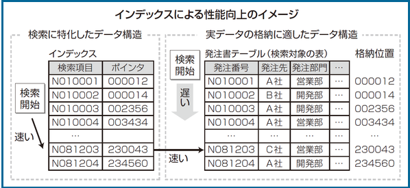

# required knowledge to make SQL faster

# Buffer
a region of a physical memory storage used to temporarily store data while it is being moved from one place to another


## how to check SQL speed including shared hit by buffer

ex)

```bash
EXPLAIN (BUFFERS,ANALYZE) select * from customer where first_name = '田中1000001';
                                                        QUERY PLAN
---------------------------------------------------------------------------------------------------------------------------
 Gather  (cost=1000.00..803233.34 rows=1 width=38) (actual time=972.253..975.125 rows=1 loops=1)
   Workers Planned: 2
   Workers Launched: 2
   Buffers: shared hit=16189 read=723580
   ->  Parallel Seq Scan on customer  (cost=0.00..802233.24 rows=1 width=38) (actual time=879.152..967.273 rows=0 loops=3)
         Filter: (first_name = '田中1000001'::bpchar)
         Rows Removed by Filter: 4006700
         Buffers: shared hit=16189 read=723580
 Planning Time: 0.079 ms
 Execution Time: 975.154 ms
(10 rows)
```
**Buffers: shared hit is Probability of finding requested block in the buffer cache and no need to read block from disk.**


バッファそのものの意味は処理しきれないデータを一時的に貯めておくための領域のことで、処理が完了次第バッファのデータも処理していく。

データベースのバッファキャッシュはバッファ機能に加えて、キャッシュ機能も含まれていて、使われたことのあるデータ??SQL statementを保存して、読み取り速度をあげる

バッファヒット率はバッファキャッシュをどの程度利用してデータベースのアクセスをしているか


# Buffers: shared hit
```
Buffers: shared hit=16189 read=723580
```

たまたまPostgreSQLのバッファー上にあったのでファイルアクセスを省略したページ数(hit=XXXX)
Buffers:は、ファイルから(≠ディスクから)読み込んだページ数(read=YYYY)

readが大量にあってhitが少ないということはディスク上から読み込んでいるデータが多く、読み込み時間がかなりかかっているということ。


## どうやってbuffer shared hitをあげるのか？？
どうやって初期化パラメータファイル（init.ora）の値を変更し、データベース・バッファ・キャッシュのサイズを変更すればいいのか？
→正解！s


#  Do I have to clear cache everytime I use 'explain' command??
→ Exactly

# データベースバッファキャッシュとキャッシュの違いは？
buffer = cache = memory

# なぜindex only scanとindex scanがそんなに速度変わらない？(1千万件ある)
一番下のテーブル画像の左側からだけデータをとるイメージ

```bash
explain (BUFFERS,ANALYZE) select first_name from customer where first_name = '田中10000000';
                                                               QUERY PLAN
----------------------------------------------------------------------------------------------------------------------------------------
 Index Only Scan using customer_first_name_idx on customer  (cost=0.56..8.58 rows=1 width=15) (actual time=0.030..0.032 rows=1 loops=1)
   Index Cond: (first_name = '田中10000000'::bpchar)
   Heap Fetches: 1
   Buffers: shared hit=5
 Planning Time: 0.093 ms
 Execution Time: 0.053 ms
(6 rows)

explain (BUFFERS,ANALYZE) select first_name, last_name from customer where first_name = '田中10000000';
                                                            QUERY PLAN
-----------------------------------------------------------------------------------------------------------------------------------
 Index Scan using customer_first_name_idx on customer  (cost=0.56..8.58 rows=1 width=30) (actual time=0.032..0.034 rows=1 loops=1)
   Index Cond: (first_name = '田中10000000'::bpchar)
   Buffers: shared hit=5
 Planning Time: 0.093 ms
 Execution Time: 0.057 ms
(5 rows)
```


----------------------------------------------------------
# FROM SQL実践入門

# When to use INDEX
- when the column is high-cardinality and low-selectivity

## high-cardinality
キーのばらつきが高いこと。例えばprofile_idが一意であればそのカラムはhigh-cardinalityと言える。
## low-selectivity
そのカラムをキーにしてレコードを絞った時に全体のレコードの何%に絞れるか。
100レコードあって、profile_idが一意であればselectivityは1%でlowだと言える。

# anti-pattern
- when not using WHERE clause
- when not be able to narrow down data
  - including when selectivity changes depending on input param from users

ex)
Even if you use the condition, selectivity is quite low

- using 'IS NULL' / any functions / 中間一致・後方一致のLIKE clause / 否定形 like <>, NOT


# What if you can't use INDEX??
## UI design
for exmaple, 検索期間にINDEXを設定したいが、ユーザーの入力で1年間とされるとlow-selectivityとなり、INDEXが無意味になる。
そこで、UIで1ヶ月分しか選べないようにするなど。

## data mart
データマートによって、テーブルの中で必要とされるカラムを切り出し、新しい小さなテーブルを作成することで、読み込み量を減らす

問題はデータ同期のタイミングで、多すぎると負担になるし、少ないと実際のものとの乖離があるため、夜間にバッチ処理をすることが多い

# INDEX only scan
出力するカラムがインデックスを設定したカラムのみの場合にINDEX only scanを使うと、I/O speed will be much faster

Indexをスキャンした時に、取得する項目である『login』はIndex情報にあるので、
テーブルからデータを引っこ抜いて『login』の項目を取得せずとも、Indexにある『login』を取得すれば良いのでは？というもの

問い合わせに対してヒープ(テーブルの主要なデータ領域)にアクセスをせずにインデックスのみで回答する

# what is index??


# three kind of JOIN
- Nested Loop（ネステッドループ結合）

外側テーブル1行ごとに内側テーブルを1周ループしながら結合する方法です。外側テーブルの行数が少なく、内側テーブルにインデックスがある場合に処理が高速になります。
- Merge Join（マージ結合）

2つのテーブルを結合キーでソート後、順番に突き合わせて結合する方法です。ソートに時間がかかる場合は有効な方法ではありません。結合キーが主キーである、または結合キーにインデックスを定義することでソート済みの状態を突き合わせることになるため、処理が高速になります。大きなテーブル同士を結合する場合に有効な方法です。
- Hash Join（ハッシュ結合）

内側テーブルの結合キーでハッシュを作成し、ハッシュと外側テーブルの行を突き合わせて結合する方法です。ハッシュはメモリーに作成するため、一度作成してしまえば、高速に結合できます。ただし、ハッシュがメモリーサイズより大きくなってしまう場合は、ファイルアクセスが発生するため処理が遅くなります。比較的小さなテーブルと大きなテーブルを結合する場合に有効な方法です。

# two kind of buffers(cache)
## data cache
often used data is stored here
## log buffer
INSERT, DELETE, UPDATE, MERGEを受け取った時に即座に反映するのではなく、一度ここに貯めてディスクへの更新はまとめてコミット時に行う

# working memory
Use this memory when doing sort or hash or something like these.

if there're not enough capacity for data we use, data use another space called TEMPDB in a storage.

# The flow of query process
## parse
- 構文を解析し、if any problems is found, error returns
- make statements clear and easy to read for DB
## optimizer
- creating as many as execution plans from indexの有無, データの偏り and so on 
- evaluate plans and choose a plan having lowest-cost 
## catalog manager
This is what gives important info like inside info of DBMS and statics of table, index... to optimizer

This is also called "static information"
## plan evaluation
choose best execution plan from multiple plans

## data access will start.

# 統計情報を最新にする
統計情報が最新になっていないことで実行計画と実際の実行速度が乖離することがある

これを防ぐために統計情報をupdateするのは common sense for DB engineer.

On postgresSQL, you can update static info manually using command below

```bash
ANALYZE <schema_name>.<table_name>
```
