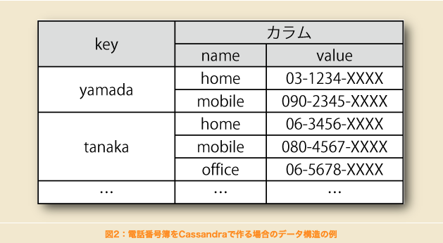
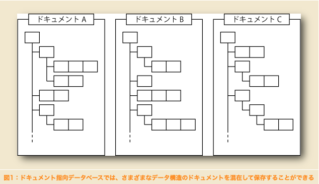
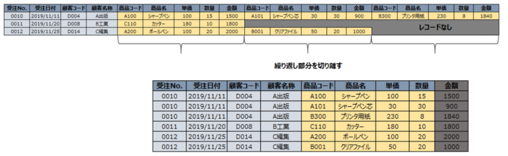
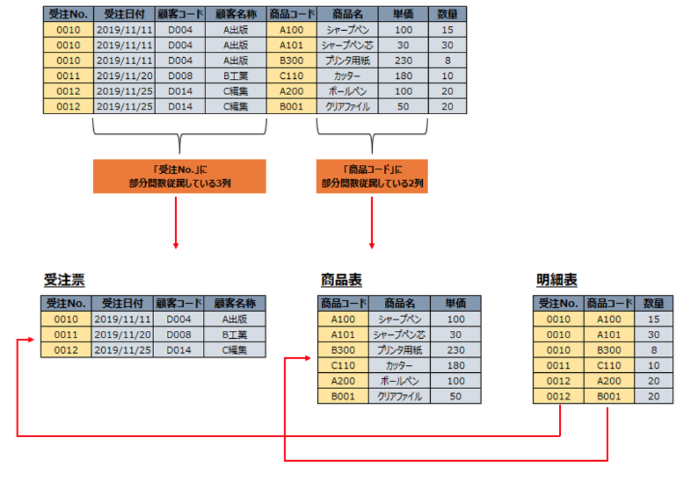
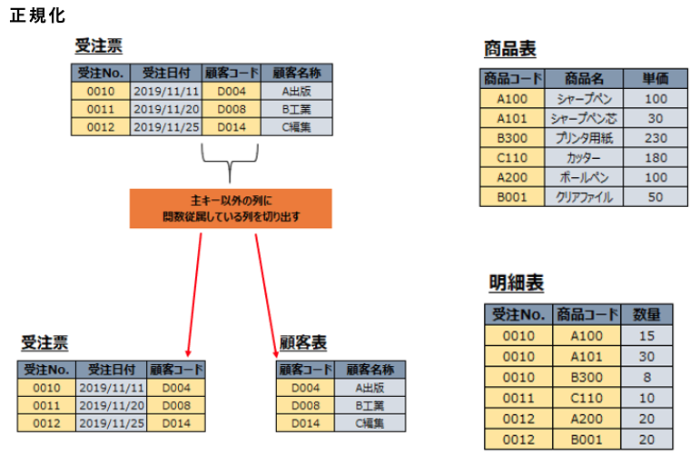
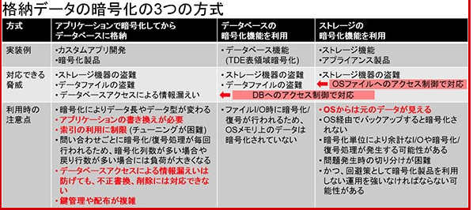

- [What to write](#what-to-write)
- [データベースの基本](#データベースの基本)
  - [DBMSの特徴](#dbmsの特徴)
    - [データの整合性を保つとは](#データの整合性を保つとは)
- [データの保存型式](#データの保存型式)
  - [リレーショナル型](#リレーショナル型)
    - [メリット](#メリット)
    - [デメリット](#デメリット)
  - [NoSQL](#nosql)
    - [メリット](#メリット-1)
    - [デメリット](#デメリット-1)
    - [ユースケース](#ユースケース)
- [NoSQLのデータ型](#nosqlのデータ型)
  - [key-value](#key-value)
    - [メリット](#メリット-2)
    - [ユースケース](#ユースケース-1)
  - [column-oriented](#column-oriented)
      - [メリット](#メリット-3)
  - [document-oriented](#document-oriented)
    - [メリット](#メリット-4)
    - [デメリット](#デメリット-2)
    - [column-orientedとの違い](#column-orientedとの違い)
    - [ユースケース](#ユースケース-2)
  - [graph](#graph)
    - [メリット](#メリット-5)
    - [ユースケース](#ユースケース-3)
- [知らなかったSQLコマンド](#知らなかったsqlコマンド)
  - [並び替え](#並び替え)
    - [小さい順](#小さい順)
    - [大きい順](#大きい順)
  - [取得するデータ数を指定](#取得するデータ数を指定)
    - [レコード数の指定](#レコード数の指定)
    - [取得開始位置の指定](#取得開始位置の指定)
  - [データ数の取得](#データ数の取得)
  - [最大値の取得](#最大値の取得)
  - [最小値の取得](#最小値の取得)
  - [合計値の取得](#合計値の取得)
  - [平均値の取得](#平均値の取得)
  - [グループ化](#グループ化)
    - [データ数の取得](#データ数の取得-1)
    - [絞り込み条件](#絞り込み条件)
    - [HAVING,WHERE違い](#havingwhere違い)
  - [内部結合](#内部結合)
    - [users table](#users-table)
    - [items table](#items-table)
    - [結合後](#結合後)
  - [外部結合](#外部結合)
    - [users table](#users-table-1)
    - [items table](#items-table-1)
    - [結合後](#結合後-1)
- [データを管理する](#データを管理する)
  - [格納される値のサイズに合わせてデータ型を選択する](#格納される値のサイズに合わせてデータ型を選択する)
  - [固定長と可変長](#固定長と可変長)
    - [固定長](#固定長)
    - [可変長](#可変長)
  - [初期値を設定する](#初期値を設定する)
  - [NULL](#null)
    - [NOT NULL制約](#not-null制約)
  - [他のテーブルと関連付ける](#他のテーブルと関連付ける)
    - [親テーブル/子テーブル](#親テーブル子テーブル)
      - [子テーブル](#子テーブル)
      - [親テーブル](#親テーブル)
  - [トランザクション](#トランザクション)
    - [デッドロック](#デッドロック)
      - [防止するには](#防止するには)
- [DBの導入](#dbの導入)
  - [正規化](#正規化)
    - [ex)shopping table](#exshopping-table)
    - [shopping table](#shopping-table)
      - [items table](#items-table-2)
  - [正規化のメリット](#正規化のメリット)
  - [第一正規形: 項目を重複させない](#第一正規形-項目を重複させない)
  - [第二正規形: 別の種類の項目を分割する](#第二正規形-別の種類の項目を分割する)
  - [第三正規形: 従属関係にある項目を分割する](#第三正規形-従属関係にある項目を分割する)
  - [テーブル名・カラム名の命名規則](#テーブル名カラム名の命名規則)
  - [シノニム・ホノニムを避ける](#シノニムホノニムを避ける)
  - [実際に作成](#実際に作成)
    - [大事なこと](#大事なこと)
- [データベースの運用](#データベースの運用)
  - [データベースの監視](#データベースの監視)
  - [データ移行](#データ移行)
  - [暗号化](#暗号化)
  - [OSやソフトウェアのバージョンを上げる](#osやソフトウェアのバージョンを上げる)
    - [手順](#手順)
- [データベースを守るための知識](#データベースを守るための知識)
  - [スロークエリ](#スロークエリ)
    - [問題](#問題)
    - [チューニング](#チューニング)
  - [インデックス](#インデックス)
    - [ユースケース](#ユースケース-4)
    - [デメリット](#デメリット-3)
    - [実例(ref)](#実例ref)
      - [UNIQUEでないインデックス](#uniqueでないインデックス)
      - [UNIQUEなインデックス](#uniqueなインデックス)
      - [複数のインデックスを指定するケース](#複数のインデックスを指定するケース)
  - [レプリケーション](#レプリケーション)
  - [SQLインジェクション](#sqlインジェクション)
    - [仕組み](#仕組み)
    - [防止するために](#防止するために)
  - [キャッシュ](#キャッシュ)
- [データベース実践入門/正規化](#データベース実践入門正規化)
  - [関数従属性](#関数従属性)
- [質問](#質問)
# What to write
「データベースのしくみ」を読んで、これまでに知らなかったことで覚えておいた方が業務に役立つというものをこのファイルにまとめる。
# データベースの基本
## DBMSの特徴
DBMSとはデータベース管理システムのことをいう
データベースそのもののことではなく、**データベースと人間の仲介をする**


ユーザーが「データを追加したい」という命令をRBMSに送ると、それをデータベースに反映するなど

- 登録するデータに対する制限を行う
- データの整合性を保つ([参考](https://www.gixo.jp/blog/12359/#:~:text=%E4%BE%8B%E3%81%88%E3%81%B0%E3%80%81%E4%BC%9A%E5%93%A1%E3%82%AB%E3%83%BC%E3%83%89,%E8%A8%80%E3%81%88%E3%81%BE%E3%81%99%E3%80%82))
- 暗号化
- アクセスできるユーザーの管理
- データ復旧

### データの整合性を保つとは
例えば、複数のユーザーが同じデータを同時に編集時に不整合なデータとならないように制御するなど

参考: [データベースの整合性とは](https://www.gixo.jp/blog/12359/#:~:text=%E4%BE%8B%E3%81%88%E3%81%B0%E3%80%81%E4%BC%9A%E5%93%A1%E3%82%AB%E3%83%BC%E3%83%89,%E8%A8%80%E3%81%88%E3%81%BE%E3%81%99%E3%80%82)

# データの保存型式
## リレーショナル型
現在では主流でほとんどのRBMSはこの形式。

よく使う表の形のもので、外部テーブルと結合するなどして自由度高く操作できる。

### メリット
- データにルールをつけることができ、規格外のデータが入りそうになれば、安全に処理前の状態に戻すことができる

- 同じデータが点在することがない → 更新コストを抑えられる
- SQLを使って、正確なデータを操作できる
- 行方向での操作に適している
### デメリット
- 大規模なデータになると処理速度がかなり落ちる
- スケールアウトするにも一貫性が保てないため難しい
- グラフやJSONのデータ格納ができない

**特にデメリットの最初の２点はビッグデータを扱う今日、かなりのデメリットにとなっている。**

## NoSQL
リレーショナル型以外のRBMSのこと

リレーショナル型のデメリットを補う際に使われる。

### メリット
- 処理が早く、大容量のデータを扱える
- スケールアウトできる
- グラフやJSONなどの様々なデータの格納ができる
### デメリット
- データの結合ができない
- 一貫性/整合性を保つ機能が弱い
- トランザクション使えないことが多い
### ユースケース
大容量のデータを高速に処理するため、

- データ解析
- リアルタイムが大事なゲーム

# NoSQLのデータ型
## key-value
keyとvalueの二つのデータをペアにしたのみのシンプルな型

### メリット
- シンプルなので読み書きが早い
- 親となるデータもないため、後から情報を分散させやすい

### ユースケース
- アクセス履歴
- ショッピングカート
## column-oriented



一行を識別するキーの中に複数のキーバリューのペアが存在する。

カラム型のようだが、
- 後から列を動的に追加することができる
- 他の行に存在しない列も作成できる
#### メリット
一行ごとに不定行なデータを入れれるため、
後からデータをどんどん追加していくことができる

行方向での操作に適している
## document-oriented

JSONやXML、firebaseの形

### メリット
JSONやXMLをそのまま入れることができる。

そのためデータ構造が変わってもそのまま対応は不要。

リレーショナルデータベースとは違って、事前にテーブルの構造を決めておく必要がない。→ スキーマレス

### デメリット
結合を多用するような複雑なデータ処理には向いていない
### column-orientedとの違い
column-orientedは親などがなく、階層型ではないが、document-orientedはJSONのように階層型

### ユースケース
MongoDB
## graph
### メリット
友達の友達などの関係を検索することができる

### ユースケース
- レコメンドシステム
- 最短経路の検索

# 知らなかったSQLコマンド
## 並び替え

### 小さい順
```
SELECT * FROM users ORDER BY age;
```
### 大きい順
```
SELECT * FROM users ORDER BY age DESC;
```

## 取得するデータ数を指定
### レコード数の指定
ex) レコードの上から２つを取得する
```
SELECT * FROM users LIMIT 2
```

### 取得開始位置の指定
ex) レコードの上から３・４番目を取得する
```
SELECT * FROM users LIMIT 1 OFFSET 2;
```
OFFSETは０が起点のためOFFSET = 2→３番目から

## データ数の取得
```
SELECT COUNT(*) FROM users;
```

## 最大値の取得
```
SELECT MAX(*) FROM users;
```

## 最小値の取得
```
SELECT MIN(*) FROM users;
```

## 合計値の取得
```
SELECT SUM(*) FROM users;
```

## 平均値の取得
```
SELECT AVG(*) FROM users;
```

## グループ化
### データ数の取得
ex) genderカラムの全ての種類(被らない)のレコードを取得

その中のgenderカラムを取得して表示する
```
SELECT gender FROM users GROUP BY gender;
```
genderカラムの全ての種類(被らない)のレコードを取得

その中のgenderカラムを取得して表示する

| name | gender | age | 
|:-:|:-:|:-:|
| yuto  | man  | 23  |
| taka  | man  | 35  | 
| mika  | man  | 34  |
| yoshi  | woman  | 45  |

gender: woman/manの二種類
その二種類のgenderを表示する
```
SELECT gender FROM users GROUP BY gender;
> man, woman
```

### 絞り込み条件
```
SELECT gender, COUNT(*) FROM users GROUP BY gender HAVING COUNT(*) >=3;
```

| name | gender | age | 
|:-:|:-:|:-:|
| yuto  | woman  | 23  |
| taka  | man  | 35  | 
| mika  | man  | 34  |
| yoshi  | woman  | 45  |


GROUP BYでグループ化した結果:
manのレコード3件、womanのレコード1件

HAVINGの結果:
manのレコード3件

### HAVING,WHERE違い
HAVING: グループ化された後に条件で絞る

WHERE: グループ化前に条件で絞る

## 内部結合
キーとなるカラムの値がテーブル内で一致するレコードのみを結合して取得する

→ 存在しない外部キーを指定した場合はそのレコードは結合後に消滅する

### users table
| username | item_id |
|:-:|:-:|
| yuto  |  1 |
| yoko  | 3  |
| iko  |  4 |
|  yute |  6 |

### items table
| id | name |
|:-:|:-:|
| 1  |  milk |
| 2  | bread  |
| 3  | noodle  |
| 4  | coffee  |
### 結合後
| username | item_name |
|:-:|:-:|
| yuto  |  milk |
| yoko  | bread  |
| iko  |  noodle |
|  yute |  coffee |
```
SELECT * FROM users INNER JOIN items ON users.item_id = items.id;
```

```SELECT * FROM users INNER JOIN items```でitemsテーブルがusersテーブルに結合される

```ON users.item_id = items.id;```でキーを指定

## 外部結合
キーとなるカラムの値がテーブル内で一致するレコードを結合するだけでなく一致しない結合元のレコードも含めて取得する

→ 存在しない外部キーを指定した場合はそのレコードは外部のカラムは空の状態で表示する

### users table
| username | item_id |
|:-:|:-:|
| yuto  |  1 |
| yoko  | 3  |
| iko  |  4 |
|  yute |  6 |

### items table
| id | name |
|:-:|:-:|
| 1  |  milk |
| 2  | bread  |
| 3  | noodle  |
| 4  | coffee  |
### 結合後
| username | item_name |
|:-:|:-:|
| yuto  |  milk |
| yoko  | bread  |
| iko  |  noodle |
|  yute |  coffee |
|  yute | - |

yuteのitem_idは存在しないため、-となる.
```
SELECT * FROM users LEFT JOIN items ON users.item_id = items.id;
```

```SELECT * FROM users LEFT JOIN items```でitemsテーブルがusersテーブルに結合される

```ON users.item_id = items.id;```でキーを指定

# データを管理する
## 格納される値のサイズに合わせてデータ型を選択する

数値であれば、
- TINYINT
- SMALLINT
- MEDIUMUNT
- INT
- BIGINT

と様々な種類があるため値の大きさによって選択する

文字列も同様に、
- CHAR
- VARCHAR
- TINYTEXT
- TEXT
- MEDIUMTEXT
- LONGTEXT

とある。

## 固定長と可変長
### 固定長
固定長は文字型だとCHAR

指定された長さになるように右側をスペースで自動で埋める

### 可変長
可変長は文字型だとVARCHAR

特にスペースで埋められることはない

## 初期値を設定する
もしあるカラムが空のレコードが追加された場合は初期値が自動で入ることになる

```
CREATE TABLE users (name VARCHAR(100), age INT DEFAULT 10);
```
ex) 商品の在庫テーブルの初期値を0にする　　　　　　　　　　　　　　　　　　　　　　　　　　　　　　　　　　　　　　　　　　
## NULL
**NULLは""や0とも異なり、そのレコードのそのフィールドには何も格納されていないことを明示的に表す**

完全に何も入っていない状態のこと

ex) 初期値の設定がないフィールドに何も設定しないレコードを挿入するとNULLになる

### NOT NULL制約
テーブル作成時に
```
age INT NOTNULL
```
のようにして制約を加えることができる

## 他のテーブルと関連付ける
### 親テーブル/子テーブル
親テーブルは参照される側

#### 子テーブル
| username | item_id |
|:-:|:-:|
| yuto  |  1 |
| yoko  | 3  |
| iko  |  4 |
|  yute |  6 |

yuteのように親テーブルにない値はエラーになる

#### 親テーブル
| id | name |
|:-:|:-:|
| 1  |  milk |
| 2  | bread  |
| 3  | noodle  |
| 4  | coffee  |

```
$ CREATE TABLE users (name VARCHAR(100), item_id INT, FOREIGN_KEY (item_id) REFERENCES items(id));
```

## トランザクション
1. START TRANSACTION;
2. UPDATE 1stRECORD
3. UPDATE 2ndRECORD
4. COMMIT;

という流れでトランザクションが行われる

途中でエラーが発生した場合はその直前の番号に戻るのではなく、トランザクション前の整合性が取れていた状態まで戻る

### デッドロック
各手順の流れでロックをして、他のユーザーがこれらのデータを操作できないようにロックする。

#### 防止するには
- トランザクション内の処理時間を短くする
- トランザクションの順番をUserA,B共に同じにする

などの工夫が必要

# DBの導入
## 正規化
一言でいうとDBのデータを整理すること

### ex)shopping table
| user | product | price |
|:-:|:-:|:-:|
| yuto  | apple  | 230  |
| miko  |  apple | 230  |
| ken  | orange  | 100  |

このようなテーブルになっている場合りんごの値段を修正しようとすると、二箇所の変更が必要となる。

しかし、productテーブルを他に切り出しておくと

### shopping table
| user | product_id | 
|:-:|:-:|
| yuto  | 1  | 
| miko  |  1 | 
| ken  | 2  | 

#### items table
| id | product | price |
|:-:|:-:|:-:|
| 1  | apple  | 230  |
| 2  | orange  | 100  |

**itemsテーブルのid=1のpriceを一度変更するだけですむため、更新の回数が減り、時間も手間も料金も節約できる**
## 正規化のメリット
- メンテナンスが楽になる
- データの容量を減らせる
- データの汎用性が上がる

## 第一正規形: 項目を重複させない
一列に同じフィールドが複数存在している部分を取り除く


## 第二正規形: 別の種類の項目を分割する
フィールドの中で切れるテーブルは切っていく

特定のカラムに対して値が決まるカラムを別テーブルに切り出す


- 商品名や値段の更新の際に複数レコードを更新する必要がなくなる
- 注文がないと、商品情報の追加ができないことをなくせる
## 第三正規形: 従属関係にある項目を分割する
従属関係:
ex) 教員名の値が決まると、教員の連絡先も自動で決まるようになっている場合にそれらを別テーブルに切り出す。



## テーブル名・カラム名の命名規則
- テーブル名・カラム名には半角英数字とアンダーバー
- 全て小文字にする
- テーブル名は複数形
- JOINするためのカラムは"_id"にする
- どの型が保存されているかわかりやすくする(boolean: is_XXXX, date: XXXX_atなど)
- XXXX_flagは避ける。is_XXXXの方が状態がわかる

## シノニム・ホノニムを避ける
- itemやproductなどは統一する
- 例えばショッピングサイトでuserは避けて、buyer/sellerにする

## 実際に作成
### 大事なこと
多の方にXXXX_idを追加することになる。
なぜなら本1に対してレビューは複数あって、レビューの詳細の本の詳細を本のテーブルで説明することになるから

# データベースの運用
## データベースの監視
監視対象としてあげられるのは以下
- データベースの操作履歴(DB内にあるログ)
- クエリのログ(DB内にあるログ)
- サーバのリソース(Cloud watchなど)

## データ移行
手順は以下
1. ダンプ(元のDBのデータを抽出)
2. リストア(ダンプデータを他のDBに入れる)

メリット
- テストや開発環境用に同一のDBを作成
- バックアップ用
- DBのバージョンアップ

## 暗号化
データを登録する時のフローは以下
1. アプリケーションのフォームなどから情報がデータベースに送られる
2. データベースで受け取った情報をストレージに送る
3. ストレージに情報を保存する

各STEP毎に情報の暗号化を行うことができる




## OSやソフトウェアのバージョンを上げる
古いままだとセキュリティホールがあったり、サポートが切れたりする。

新しくすることで、セキュリティ・性能の向上が見込める。

### 手順
1. 元のバージョンの設定や環境を記録する
2. バックアップを取る
3. バージョンアップする
4. テストする

- errorがでないか
- SQLの処理に時間がかかっていないか
- ログやサーバーのリソースに問題が出ていないか

# データベースを守るための知識
## スロークエリ
SQLの実行に時間がかかっているSLQ文のこと

RBMSによってはスロークエリとその実行時間を出力したり、一覧表示したりできる。
### 問題
- データ集計・操作に時間がかかる
- ページの表示に時間がかかる
- サーバの負荷がかかる

### チューニング
スロークエリを最適化すること。

代表的なものは

- SQLの文を修正するという方法
→クエリを修正して取得の仕方を変えるだけで早く同じ結果を取得できる

他にも
- テーブルにインデックスを使う

などもあげられる
## インデックス
本の索引のようなもの
主キーは自動的に主キーとしてのインデックスが作成される

**検索やソートの条件に頻繁に用いるカラムのインデックスを登録しておくことで、データ取得の性能をあげることができる**

### ユースケース
- データ量が多く、その中からデータを抽出する際
- カラムに格納されている値の種類が多い場合

など

```
SELECT * FROM users where name = '山田' ORDER BY 'age'
```

この場合だとname,ageなど

**つまり性別のように種類が少ないものではなく、名前のように多くの種類があるものにインデックスを設定する。**

### デメリット
- インデックス用の領域が必要となるため、ディスク容量を消費する
- データ編集時にインデックスの更新も行うため、更新時の速度低下

### 実例([ref](https://www.dbonline.jp/mysql/index/index1.html))
#### UNIQUEでないインデックス
```
CREATE INDEX index_name ON tbl_name (col_name, ...)
```

インデックス名( index_name )と対象となるテーブル名( tbl_name )とカラム名( col_name )を指定してインデックスを作成

名前などのインデックスが複数あってもエラーにならず、検索時には二つとも表示される

#### UNIQUEなインデックス
```
CREATE UNIQUE INDEX index_name ON tbl_name (col_name, ...)
```
#### 複数のインデックスを指定するケース
カラムA、カラムB、それぞれで検索することが多い場合は、それぞれでインデックスを作成し、

カラムAとカラムBをあわせ検索することが多い場合は、カラムAとカラムBを合わせたインデックスを作成。

## レプリケーション
レプリケーションをすることで
- 処理を分散できる
- 障害発生時に正常なDBに切り替えられる

## SQLインジェクション
### 仕組み
UserのID入力フォームで

「1」

と入力すると

```
SELECT * FROM users WHERE id = 1
```

が実行される時に、もし

「1 OR 1 = 1」

と入力すると、

```
SELECT * FROM users WHERE id = 1 OR 1 = 1
```

が実行されてしまい、idが1の場合か、1=1→Trueという場合になってしまい全件取得されてしまう。

### 防止するために
- 入力値のエスケープ処理

入力された値をそのままSQLに使用せず、文字列として扱う形に変換してからSQLに適用する

- WAFで不正なアクセスを遮断する

## キャッシュ
一度利用したデータを読み込みの速いディスク領域に一時的に保存しておき、再び同じデータを利用するときに高速に読み込めるようにする

サイトで前日の商品ランキングをよく見られるが、その日のうちは毎回変わるものではない。→キャッシュの出番

**キャッシュはデータベースと連携したフレームワークやソフトウェアにデフォルトであって、特に設定は不要なケースが多い**

# データベース実践入門/正規化
## 関数従属性
Aの値がわかるとBの値も決まること

異なるAがわかると、同じBが決まっても問題ない。Bは重複が許される。


# 質問
- EC2でmysqlとdjangoAPIとvueでアプリ作る場合はサーバーを別で３つ用意することになる？
  - djangoAPIとvue+RDSとかだとサーバー二つになる気がする。外部のデータベースサーバーだから別なはず。
- Amazon Aurora PostgreSQLを本番環境で使う場合に、開発環境はどうなるのか。ローカルverAmazon Aurora PostgreSQLみたいのがあって、それをインストールする？w
  - Auroraと言ってもPosgreだから、ローカルでは各それぞれのPCにpostgresをinstallして、そこに登録とかしてみる。オープンソースなので特にお金はかからない。
  - AWSには本番環境とステージング環境(開発環境)の二台のAutoraを準備する。AWSが管理するため金かかる。自分たちで管理するならサーバー費用(ローカルもPC動かす電気代とかはかかってる)くらいしかかからない