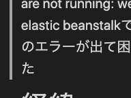

# タイトル
【ERROR】 Following services are not running: web. elastic beanstalkでこのエラーが出て困った

# 経緯
elastic beanstalkを利用して、[公式チュートリアル](https://docs.aws.amazon.com/ja_jp/elasticbeanstalk/latest/dg/create-deploy-python-django.html#python-django-configure-for-eb)を参考に、Djangoアプリのデプロイが完了したかと思いきや、重大なエラーが発生していた。


ちょちょっと調べたものをコピペして実践してみるくらいじゃどうにもならないので、ログを一つずつ確認していくことにする。

# エラーログの確認方法


### elastic beanstalkのエラーログを確認する


1. この画面の通り、利用している環境を開いて左のサイドバーのログから右のログのリクエスト。
2. フルログをクリックし、ダウンロード。
3. ローカルでログを確認する


【ERROR】は一つも見つからない。。。
どうやらelastic beanstalkの問題ではなく、nginxの問題か


### nginxのエラーログを確認する
```/Users/自分の名前/.ssh```に```eb init```したときにできたEC2インスタンスへのkeyが入っているからそこに移動する

```terminal
$ cd /Users/自分の名前/.ssh
```
key_nameだけのものやkey_name.pubなどあるが、EC2instanceにログインする時はkey_name単体のものを使う

```terminal
$ ssh -i key_name ec2-user@利用しているec2インスタンスのパブリック IPv4 DNS
Enter passphrase for key 'tinder':
→ eb initで入力したpassphaseを再度入力

t  _____ _           _   _      ____                       _        _ _
 | ____| | __   ___| |_(_) ___| __ )  ___  __ _ _ __  ___| |_ __ _| | | __
 |  _| | |/ _ \/ __| __| |/ __|  _ \ / _ \/ _\ | '_ \/ __| __/ _\ | | |/ /
 | |___| | (_| \__ \ |_| | (__| |_) |  __/ (_| | | | \__ \ || (_| | |   <
 |_____|_|\__,_|___/\__|_|\___|____/ \___|\__,_|_| |_|___/\__\__,_|_|_|\_\

 Amazon Linux 2 AMI

 This EC2 instance is managed by AWS Elastic Beanstalk. Changes made via SSH
 WILL BE LOST if the instance is replaced by auto-scaling. For more information
 on customizing your Elastic Beanstalk environment, see our documentation here:
 http://docs.aws.amazon.com/elasticbeanstalk/latest/dg/customize-containers-ec2.html
```
ログインできたら、エラーログ を探す。

https://docs.aws.amazon.com/ja_jp/elasticbeanstalk/latest/dg/using-features.logging.html
> 各アプリケーションとウェブサーバーは、固有フォルダにログを保存します。
Apache – /var/log/httpd/
IIS – C:\inetpub\wwwroot\
Node.js – /var/log/nodejs/
nginx – /var/log/nginx/
Passenger – /var/app/support/logs/
Puma – /var/log/puma/
Python – /opt/python/log/
Tomcat – /var/log/tomcat8/

```terminal
$ less /var/log/nginx/error.log

request: "GET / HTTP/1.1", upstream: "http://127.0.0.1:8000/", host: "tinder-api.eba-9rhdy4mn.us-west-2.elasticbeanstalk.com"
2022/01/16 22:33:19 [error] 4113#4113: *397 connect() failed (111: Connection refused) while connecting to upstream, client: 172.31.37.175, server: , request: "GET /favicon.ico HTTP/1.1", upstream: "http://127.0.0.1:8000/favicon.ico", host: "tinder-api.eba-9rhdy4mn.us-west-2.elasticbeanstalk.com", referrer: "http://tinder-api.eba-9rhdy4mn.us-west-2.elasticbeanstalk.com/"
...skipping...
2022/01/16 22:01:32 [error] 3528#3528: *19 connect() failed (111: Connection refused) while connecting to upstream, client: 172.31.31.132, server: , request: "GET / HTTP/1.1", upstream: "http://127.0.0.1:8000/", host: "34.210.98.47"
2022/01/16 22:01:33 [error] 3528#3528: *19 connect() failed (111: Connection refused) while connecting to upstream, client: 172.31.31.132, server: , request: "POST /HNAP1/ HTTP/1.1", upstream: "http://127.0.0.1:8000/HNAP1/", host: "34.210.98.47"
2022/01/16 22:05:24 [error] 3528#3528: *76 connect() failed (111: Connection refused) while connecting to upstream, client: 172.31.37.175, server: , request: "GET / HTTP/1.1", upstream: "http://127.0.0.1:8000/", host: "50.112.42.58"
2022/01/16 22:05:25 [error] 3528#3528: *76 connect() failed (111: Connection refused) while connecting to upstream, client: 172.31.37.175, server: , request: "POST /HNAP1/ HTTP/1.1", upstream: "http://127.0.0.1:8000/HNAP1/", host: "50.112.42.58"
2022/01/16 22:09:11 [error] 4113#4113: *44 connect() failed (111: Connection refused) while connecting to upstream, client: 172.31.37.175, server: , request: "GET / HTTP/1.1", upstream: "http://127.0.0.1:8000/", host: "tinder-api.eba-9rhdy4mn.us-west-2.elasticbeanstalk.com"
2022/01/16 22:09:12 [error] 4113#4113: *44 connect() failed (111: Connection refused) while connecting to upstream, client: 172.31.37.175, server: , request: "GET /favicon.ico HTTP/1.1", upstream: "http://127.0.0.1:8000/favicon.ico", host: "tinder-api.eba-9rhdy4mn.us-west-2.elasticbeanstalk.com", referrer: "http://tinder-api.eba-9rhdy4mn.us-west-2.elasticbeanstalk.com/"
2022/01/16 22:10:58 [error] 4113#4113: *72 connect() failed (111: Connection refused) while connecting to upstream, client: 172.31.37.175, server: , request: "GET / HTTP/1.1", upstream: "http://127.0.0.1:8000/", host: "50.112.42.58"
2022/01/16 22:27:11 [error] 4113#4113: *305 connect() failed (111: Connection refused) while connecting to upstream, client: 172.31.31.132, server: , request: "GET / HTTP/1.1", upstream: "http://127.0.0.1:8000/", host: "34.210.98.47"
2022/01/16 22:27:27 [error] 4113#4113: *310 connect() failed (111: Connection refused) while connecting to upstream, client: 172.31.37.175, server: , request: "GET / HTTP/1.1", upstream: "http://127.0.0.1:8000/", host: "50.112.42.58"
2022/01/16 22:27:28 [error] 4113#4113: *310 connect() failed (111: Connection refused) while connecting to upstream, client: 172.31.37.175, server: , request: "POST /HNAP1/ HTTP/1.1", upstream: "http://127.0.0.1:8000/HNAP1/", host: "50.112.42.58"
2022/01/16 22:33:18 [error] 4113#4113: *397 connect() failed (111: Connection refused) while connecting to upstream, client: 172.31.37.175, server: , request: "GET / HTTP/1.1", upstream: "http://127.0.0.1:8000/", host: "tinder-api.eba-9rhdy4mn.us-west-2.elasticbeanstalk.com"
2022/01/16 22:33:19 [error] 4113#4113: *397 connect() failed (111: Connection refused) while connecting to upstream, client: 172.31.37.175, server: , request: "GET /favicon.ico HTTP/1.1", upstream: "http://127.0.0.1:8000/favicon.ico", host: "tinder-api.eba-9rhdy4mn.us-west-2.elasticbeanstalk.com", referrer: "http://tinder-api.eba-9rhdy4mn.us-west-2.elasticbeanstalk.com/"
```

Nginxのコネクションの問題か。


#### nginxのconfを修正する
[Nginxのupstreamに安易にlocalhostと書くと嵌まる罠、またはドメイン名解決の挙動](https://qiita.com/yokomotod/items/46229f0fafd95eb7d867)によるとnginxのconfを
localhost ではなく 127.0.0.1 とすると解消するらしい。

みてみる。

```terminal
$ cat /etc/nginx/conf.d/elasticbeanstalk
location / {
    proxy_pass          http://127.0.0.1:8000;
    proxy_http_version  1.1;

    proxy_set_header    Connection          $connection_upgrade;
    proxy_set_header    Upgrade             $http_upgrade;
    proxy_set_header    Host                $host;
    proxy_set_header    X-Real-IP           $remote_addr;
    proxy_set_header    X-Forwarded-For     $proxy_add_x_forwarded_for;
}
```
127.0.0.1 になっている。詰んだか？？

### 他に試したこと
brew reinstall awsebcli しても変わらず

### 気になる点
Python – /opt/python/log/
でログを調べようとしたが/opt/配下にpythonディレクトリが存在しない

