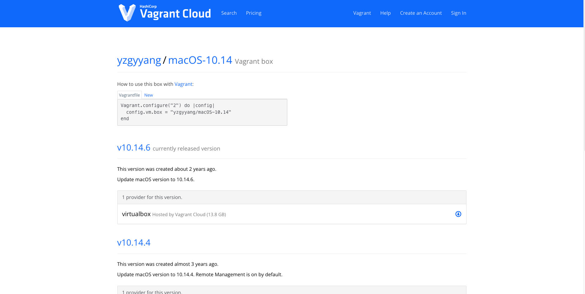

# vagrantの使い方

## vagrantの公式からBOXを選ぶ

[この辺り](https://app.vagrantup.com/boxes/search?order=desc&page=1&provider=virtualbox&q=&sort=downloads&utf8=%E2%9C%93)からvagrantの仮想環境で使いたいBOX(OSと思ってもいい)を選択する

今回は[yzgyyang/macOS-10.14](https://app.vagrantup.com/yzgyyang/boxes/macOS-10.14)を仮想環境で利用していこうと思う。



```bash
Vagrant.configure("2") do |config|
  config.vm.box = "yzgyyang/macOS-10.14"
end
```

```yzgyyang/macOS-10.14```をコピーしておく
 
## vagrantを設定する
vagrant用のディレクトリを作成する

```
$ mkdir ~/vagrant/tvagrant_test
$ cd ~/vagrant/tvagrant_test
```

vagrantを立ち上げる
```
$ vagrant init
```

するとディレクトリ内にVagrantfileというファイルが作成されるため、先ほどコピーしたbox名を下記のように記述する

```bash
・
・
・
Vagrant.configure("2") do |config|
  # The most common configuration options are documented and commented below.
  # For a complete reference, please see the online documentation at
  # https://docs.vagrantup.com.

  # Every Vagrant development environment requires a box. You can search for
  # boxes at https://vagrantcloud.com/search.

  # 変更
  config.vm.box = "yzgyyang/macOS-10.14"

  # Disable automatic box update checking. If you disable this, then
  # boxes will only be checked for updates when the user runs
  # `vagrant box outdated`. This is not recommended.
  # config.vm.box_check_update = false

・
・
・
```

## vagrantを立ち上げる

```
$ vagrant up 
```

## vagrantの仮想環境にログインする

```
$ vagrant ssh
```

## まとめ
vagrantとか仮想環境とか聞くと大変そうだが、手順はこれだけ。
個人開発とかプライベートでもローカルを汚したくない人には仮想環境はとてもおすすめ。